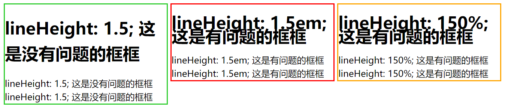

# CSS `line-height` 属性指南

`line-height` 属性在CSS中用于指定行间的空间，这对于文本的布局和可读性至关重要。正确使用 `line-height` 可以提高网页的美观性和用户体验。

## 基本用法

`line-height` 可以设置为以下几种值：

### 1. 绝对值 (`px`, `pt` 等)

- **定义**: 指定 `line-height` 的固定值，不受父元素字体大小的影响。
- **优点**: 非常明确，不会因为继承而改变。
- **缺点**: 不灵活，不适合响应式设计。当字体大小改变时，固定的行高可能不再适合，导致布局问题或可读性问题。
- **适用场景**: 当你需要确保元素的行高不受任何因素影响，保持固定不变时。

### 2. 相对值 (`em`, `%` 等)

- **定义**: 相对于当前元素的字体大小来设置行高。例如，`1.5em` 或 `150%` 都是基于元素自身的 `font-size` 来计算行高。
- **优点**: 相对于元素的字体大小，能够保持行间距和字体大小的协调一致，适应不同字体大小的调整。
- **缺点**: 当多层继承时，可能导致意外的行高值，因为它是基于父元素的字体大小计算的，而不是最初设定的元素。
- **适用场景**: 在需要根据元素字体大小调整行高的情况下，如调整段落内文本的行间距。

### 3. 无单位的倍数

- **定义**: 直接指定一个数字，表示行高是元素 `font-size` 的多少倍，这是最灵活的方法。
- **优点**: 非常灵活，无论父元素的 `font-size` 如何变化，行高总是与当前元素的字体大小成比例，易于保持文本的可读性。
- **缺点**: 在某些复杂的布局中，可能需要更精确的行高控制，这时无单位的倍数可能不够灵活。
- **适用场景**: 适合大多数情况，特别是在响应式设计中，能够保持跨设备的一致性和可读性。

## 建议使用

通常推荐使用 **无单位的倍数** 方法来设置 `line-height`，因为这种方法提供了最好的灵活性和可维护性。它确保无论字体大小如何变化，行高都能保持与字体大小的合适比例，这对于响应式设计来说是非常重要的。无单位的倍数也避免了相对值可能带来的继承问题，因为它总是相对于当前元素的字体大小计算，而不是基于父元素或更高级别的字体大小。

## 注意事项

1. **继承**: `line-height` 是一个可以被继承的属性，子元素会继承父元素的计算后的 `line-height` 值，而不是相对值。这可能导致子元素的 `line-height` 与其 `font-size` 不匹配。
2. 全局与局部应用:
   - 可以在全局级别（如 `html` 或 `body`）设置基本的 `line-height`，以确保整个网站有一个统一的行高标准。
   - 针对特定元素或组件设置 `line-height`，以满足特定的布局或设计需求。
3. **避免固定行高**: 尽量避免使用像素等固定单位设置 `line-height`，以确保更好的响应式设计和文本可读性。

## Demo演示

以下是一个简单的示例，展示了如何在HTML和CSS中使用 `line-height`：

### HTML

```html
<div class="box green">
    <h1>lineHeight: 1.5; 这是没有问题的框框</h1>
    lineHeight: 1.5; 这是没有问题的框框
    lineHeight: 1.5; 这是没有问题的框框
</div>

<div class="box red">
    <h1>lineHeight: 1.5em; 这是有问题的框框</h1>
    lineHeight: 1.5em; 这是有问题的框框
    lineHeight: 1.5em; 这是有问题的框框
</div>

<div class="box orange">
    <h1>lineHeight: 150%; 这是有问题的框框</h1>
    lineHeight: 150%; 这是有问题的框框
    lineHeight: 150%; 这是有问题的框框
</div>
```

### CSS

```css
.green {
    line-height: 1.5;
    border: solid limegreen;
}

.red {
    line-height: 1.5em;
    border: solid red;
}

.orange {
    line-height: 150%;
    border: solid orange;
}

h1 {
    font-size: 30px;
}

.box {
    width: 18em;
    display: inline-block;
    vertical-align: top;
    font-size: 16px;
}
```

这个HTML示例展示了三种不同的方式来设置元素的`line-height`，并通过颜色编码的边框来区分它们

- `.green` 类 — 使用无单位的倍数 (`line-height: 1.5;`)
- `.red` 类 — 使用相对单位 (`line-height: 1.5em;`)
- `.orange` 类 — 使用百分比 (`line-height: 150%;`)



### 总结

- `.green`类使用的无单位倍数方法是最灵活和最推荐的方法。
- `.red`和`.orange`类展示了当使用相对单位时可能出现的问题。

为了避免这些问题，最好使用无单位的倍数来设置`line-height`，特别是在涉及继承和响应式设计的上下文中。


