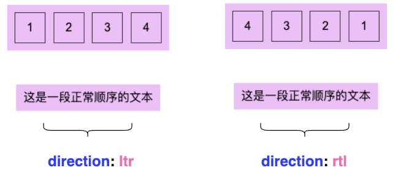
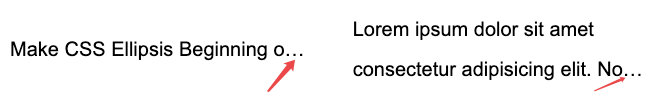
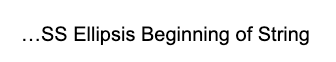
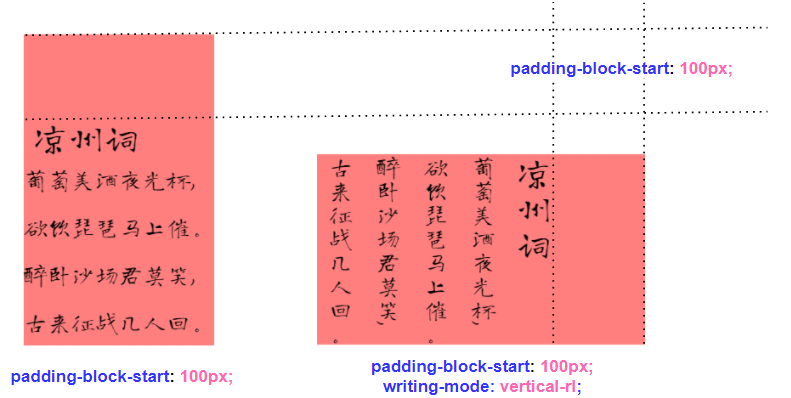

# 排版顺序与逻辑位置

## 一、排版属性

### `writing-mode` 

`writing-mode` 基本只需要留意最常见的 `horizontal-tb`、`vertical-lr`、`vertical-rl` 。表示文本的行进方向

[](https://user-images.githubusercontent.com/8554143/125310864-89eaca80-e365-11eb-8f22-489b3a3be9a7.png)

### `direction` 

`direction` **表示子元素排列的方向**。

- `ltr`：默认属性。可设置文本和其他元素的默认方向是从左到右。
- `rtl`：可设置文本和其他元素的默认方向是从右到左。

我们分别给两组元素的父容器 `<p>` 和 `<ul>` 加上 `direction: ltr` 及 `direction: rtl`，则最终效果如下：

[](https://user-images.githubusercontent.com/8554143/125786086-ddf374f7-723b-4a59-a8c2-733a6c322707.png)

可以看到，`direction` 可以改变子元素的排列方向，但是**无法改变单段文本内（或是内联元素内），每一个文字的书写顺序**。

### `unicode-bidi` 

`unicode-bidi` CSS 属性与文本的双向算法有关，主要用于处理混合了不同方向文字（如阿拉伯语、希伯来语与英语）的内容。这个属性有以下几个可能的值：

1. **`normal`**:
   - 默认值。元素不开启额外的双向隔离或覆盖。浏览器会根据文本的自然语言方向来渲染文本。
2. **`embed`**:
   - 此值指示浏览器将元素的内容视为嵌入式对象，用其自身的双向算法隔离内容，而不是继承其父元素的方向性。这意味着元素内的文本会按照元素的 `direction` 属性显示，但这个元素内部的双向文本处理仍然遵循Unicode的双向算法。
3. **`bidi-override`**:
   - 此值创建一个双向覆盖。元素内的文本会完全根据元素的 `direction` 属性强制显示，忽略任何内嵌文本的自然语言方向。这意味着所有文本都会从左到右或从右到左显示，取决于 `direction` 属性的设置，而不考虑文本本身的语言或符号。
4. **`isolate`**:
   - 此值表示元素的内联内容应该被隔离，以避免其双向性影响到外部内容。这对于那些可能会破坏周围文本方向性的元素（如用户生成的内容）特别有用。
5. **`isolate-override`**:
   - 这个值结合了 `isolate` 和 `bidi-override` 的效果。它首先将元素内容隔离，然后在这个隔离的范围内应用双向覆盖，强制内容按照指定的方向渲染。
6. **`plaintext`**:
   - 此值指示元素的内容应该按照纯文本的双向算法来渲染，即元素内的文本方向将根据内容的第一个强方向性字符来确定。这对于那些内容方向未知的文本（如电子邮件或文档内容）特别有用。

这里除了 `unicode-bidi: bidi-override`，`unicode-bidi: isolate-override` 也能得到同样的效果。

[](https://user-images.githubusercontent.com/8554143/125788234-a9a787ad-496f-4adf-ad30-11c842d2a3cf.png)

> 一个区域内有总体方向，决定从这个区域的哪边开始书写文字，通常称为基础方向。**浏览器会根据你的默认语言来设置默认的基础方向，如英语、汉语的基础方向为从左到右，阿拉伯语的基础方向为从右到左**。

在 Web 中，我们有 3 种方式可以控制文字方向：

1. HTML 实体：`‎&lrm;` 和 `‏&rlm;`
2. `<bid>` 与 `<bdo>` 标签 与 `dir` 属性
3. CSS 属性 `direction` + `unicode-bidi`

更为详尽的内容，你可以参考 [UNICODE BIDIRECTIONAL ALGORITHM](https://unicode.org/reports/tr9/)

## 二、实际应用

除去本身的功能，下面我们来看看它们其它的一些应用场景。

### 古诗词

`writing-mode` 非常适合用于进行一些创意排版。基础的类似中国古诗词的一些竖向展示：

```html
<div class="g-wrap">
    <h2>凉州词</h2>
    <p>葡萄美酒夜光杯,</p>
    <p>欲饮琵琶马上催。</p>
    <p>醉卧沙场君莫笑,</p>
    <p>古来征战几人回。</p>
</div>
```

```css
.rl {
    writing-mode: vertical-rl;
}
.lr {
    writing-mode: vertical-lr;
}
```

[](https://user-images.githubusercontent.com/8554143/126026009-5d8c6c3f-d8dc-48c6-9943-9158ab0edf80.png)

### 报纸排版

 `writing-mode:vertical-rl` 实现标题的竖向排列，搭配内容形成有意思的报纸排版：

```html
<div>
  <h2>Title Loomings</h2>
  <p>Call me Ishmael. Some years ago- never mind ho....
  </p>
</div>
```


```css
div {
  width: 750px;
  padding-left: 150px;
}
h2 {
  position: absolute;
  writing-mode: vertical-rl;
}
```

[](https://user-images.githubusercontent.com/8554143/125925057-3add57c5-e668-4365-93ff-746531de5a0a.png)

### 开头省略（单行）

我们都知道，本文超长溢出的省略，通过都是在文本的最末尾。像是这样：

```html
<p>Make CSS Ellipsis Beginning of String</p>
```

```css
p {
    overflow: hidden;
    text-overflow: ellipsis;
    white-space: nowrap;
}
```

[](https://user-images.githubusercontent.com/8554143/125794003-c36a72f4-b146-40d3-ac5e-3158f2a7a901.png)

这里，我们可以通过 `direction`，将省略打点的位置，从尾部移动至头部：

```css
p {
    direction: rtl;
}
```

[](https://user-images.githubusercontent.com/8554143/125794830-770a22d6-89e0-4ecc-ba9d-936d6dffd233.png)

> 尝试了下运用在多行省略中，多行省略的打点会出现在最后一行的左侧，不符合需求。

[CodePen Demo -- CSS Ellipsis Beginning of String](https://codepen.io/Chokcoco/pen/BaWBELx)

### 改变文字图标方向

这个小技巧是在张老师的博客中学到的：[改变CSS世界纵横规则的writing-mode属性](https://www.zhangxinxu.com/wordpress/2016/04/css-writing-mode/)

我们可以通过 `writing-mode: vertical-rl`，hover 的时候，将箭头元素转一个 90° 角：

```html
<div>➤</div>
```

```css
div:hover {
    writing-mode: vertical-rl;
}
```


[](https://user-images.githubusercontent.com/8554143/125922028-71f41f68-7d35-4955-813b-10754df86d83.gif)

> 当然，现在这个功能完全可以用 `transform` 替代，但是在之前需要兼容 IE 系列的时候，不失为一个有意思的小技巧。

## 三、逻辑位置

思考如下这样一个 DEMO，我们希望给古诗的题目的上方，添加一个 padding 值：

[](https://user-images.githubusercontent.com/8554143/126026735-85a873d4-39e7-41a0-b9f1-a720022eb15f.png)

可以看到，无论 `writing-mode` 如何，`padding-top` 始终指代物理方向的上方。

基于这种不同排版规则，CSS 在 [CSS Logical Properties and Values Level 1](https://drafts.csswg.org/css-logical/) 规范中，推出了 CSS 逻辑属性。

**CSS 逻辑属性**引入的属性与值能做到从逻辑角度控制布局，而不是从物理、方向或维度来控制。

还是上述的 DEMO，我们可以使用 `padding-block-start` 替代 `padding-top`。

[](https://user-images.githubusercontent.com/8554143/126026912-e560803d-77c9-492a-8357-a138133bea9e.png)

`padding` 的位置由物理上的上方，变成了逻辑上的上方。

### 逻辑属性映射

类似这样的属性，在规范中定义了挺多的，简单罗列一下具体的映射规则：

#### `margin` 

| Property 属性 | Logical Property 逻辑属性 |
| ------------- | ------------------------- |
| margin-top    | margin-block-start        |
| margin-left   | margin-inline-start       |
| margin-right  | margin-inline-end         |
| margin-bottom | margin-block-end          |

#### `padding` 

| Property 属性  | Logical Property 逻辑属性 |
| -------------- | ------------------------- |
| padding-top    | padding-block-start       |
| padding-left   | padding-inline-start      |
| padding-right  | padding-inline-end        |
| padding-bottom | padding-block-end         |

#### `border` 

| Property 属性                      | Logical Property 逻辑属性                |
| ---------------------------------- | ---------------------------------------- |
| border-top{-size\|style\|color}    | border-block-start{-size\|style\|color}  |
| border-left{-size\|style\|color}   | border-inline-start{-size\|style\|color} |
| border-right{-size\|style\|color}  | border-inline-end{-size\|style\|color}   |
| border-bottom{-size\|style\|color} | border-block-end{-size\|style\|color}    |

#### `relative` 

| Property 属性 | Logical Property 逻辑属性 |
| ------------- | ------------------------- |
| top           | inset-block-start         |
| left          | inset-inline-start        |
| right         | inset-inline-end          |
| bottom        | inset-block-end           |

完整的列表，你可以戳这里：[MDN - CSS 逻辑属性与值](https://developer.mozilla.org/zh-CN/docs/Web/CSS/CSS_Logical_Properties)

在逻辑属性中没有方向性的概念，只有开始（start）和结束（end）、块（block）和内联（inline）的概念。比如说，在从左到右（LTR）中，start 是 left，但在从右到左（RTL），它是 right。

### 逻辑属性下的盒子模型

考虑到不同排版带来的逻辑问题，整个盒子模型也可以随之进行改变。

下图，左边是物理盒子模型，右边是逻辑属性下的盒子模型。

[](https://user-images.githubusercontent.com/8554143/126159755-f13a52da-2ec9-46c3-a3af-3dae0fbe69fb.png)

### 物理方向与逻辑方向重叠

当然，还有这样一种情况，就是设置的逻辑方向和物理方向重叠，譬如我们给一个正常从左往右，从上至下的元素同时设置 `padding-top` 和 `padding-block-start`，看看会发生什么：

```
div {
    padding-top: 120px;
    padding-block-start: 100px;
}
```


[](https://user-images.githubusercontent.com/8554143/126258614-5e79d794-f0f3-4e1f-82db-f90e1fcc7710.png)

这里如果物理方向与逻辑方向设置的 `padding` 重叠，将会取两个值中后面定义的那个。这里由于 `padding-block-start` 后于 `padding-top` 定义，所以 `padding` 的值为 `100px`。

`margin` 和 `border` 同理。这里我的理解是，同个方向上还是只能存在一个 `margin\padding\border`，无论是逻辑方向还是物理方向，取后定义的值为准。

