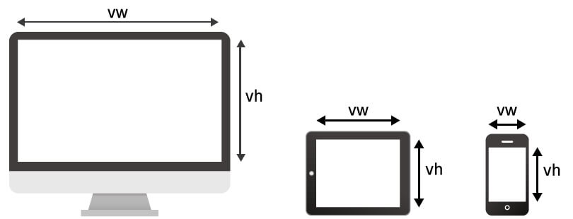
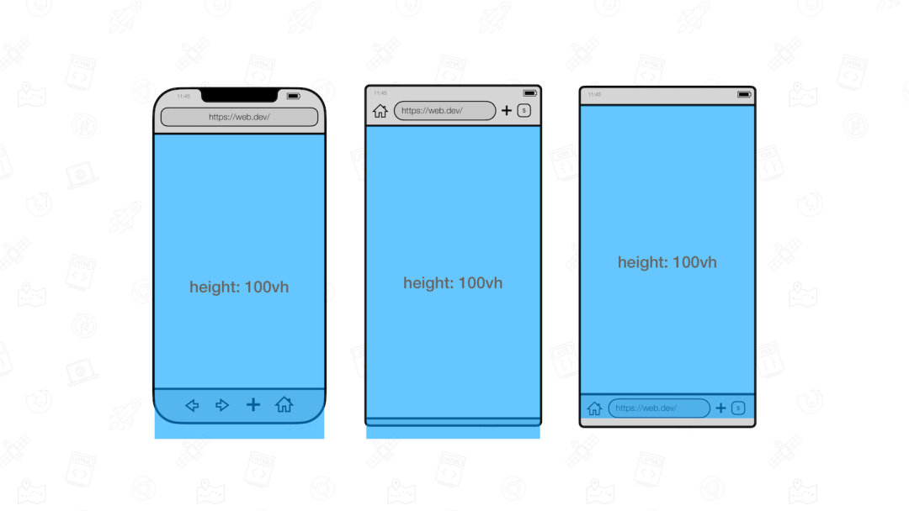
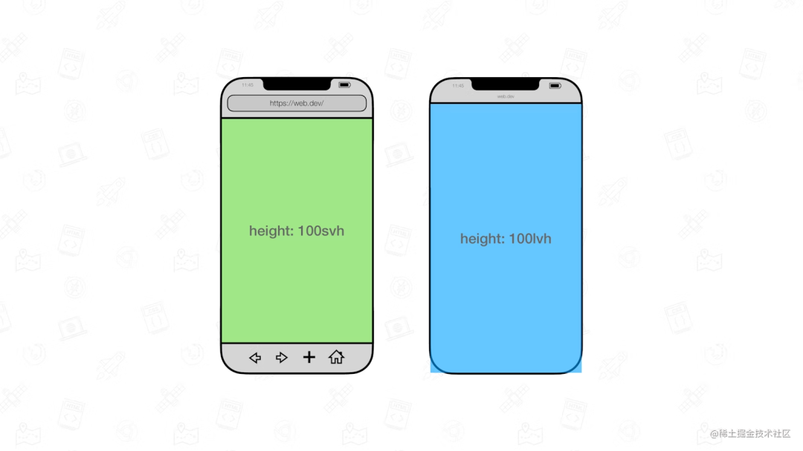
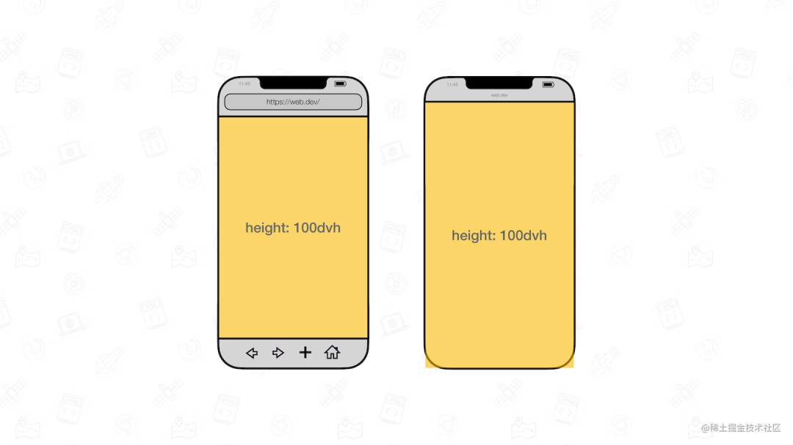
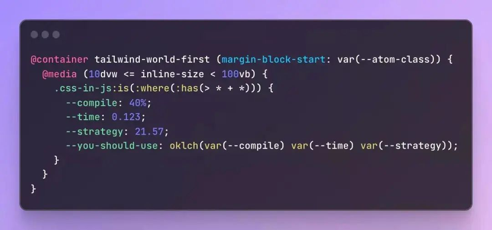

# 视口单位

## 基础单位

在 CSS 中，有 `vw、vh、vmax、vmin` 这几个与视口 `Viewport` 相关的单位。

1. `1vw` 等于`1/100`的视口宽度 （`Viewport Width`）
2. `1vh` 等于`1/100`的视口高度 （`Viewport Height`）
3. `vmin` — `vw` 和 `vh` 中较小的值
4. `vmax` — `vw` 和 `vh` 中较大的值

## vi、vb

1. `vi`：vi 代表 Viewport Inline，代表文档的内联方向。在水平书写方向上，这对应于视口的宽度，而在垂直书写方向上，这表示视口的高度。记住 inline 方向的简单方法是记住它与文本的方向相同。
2. `vb`：vb 代表 Viewport block，代表文档的块方向。这与 vi 水平书写方向相反，这将对应于视口高度，而在垂直文档中，这将表示视口的宽度。

## 基础单位在移动端的问题

在移动端，**100vh 不总是等于一屏幕的高度**。有的时候，100vh 高度会出现**滚动条**。

根因在于：

1. 很多浏览器，在计算 100vh 的高度的时候，会把地址栏等相关**控件的高度**计算在内
2. 同时，很多时候，由于会弹出软键盘等操作，在弹出的过程中，`100vh` 的计算值并不会实时发生变化！

这也就变相导致了许多基于 `100vh` 想实现的效果无形中会产生很多问题。

## 新视口单位

为了解决上述的问题，规范新推出了三类单位，分别是：

1. The large viewport units（大视口单位）：`lvw`,`lvh`, `lvi`, `lvb`, `lvmin`, and `lvmax`
2. The small viewport units（小视口单位）：`svw`, `svh`, `svi`, `svb`, `svmin`, and `svmax`
3. The dynamic viewport units（动态视口单位）：`dvw`, `dvh`, `dvi`, `dvb`, `dvmin`, and `dvmax`

别看看上去很多，其实很好记忆，vw/vw/vmax/vmin 的前缀是 v，而：

1. 大视口单位的前缀是 `lv`，意为 large viewport
2. 小视口单位的前缀是 `sv`，意为 small viewport
3. 动态视口单位的前缀是 `dv`，意为 dynamic viewport

这里我们着重关注 `lvh`、`svh`、`dvh`。它们三者与 `vh` 有什么异同呢？

先来看大视口与小视口，规范对它们的定义是：

1. 大视口（Large Viewport）：视口大小假设任何动态扩展和缩回的 UA 界面都没有展开
2. 小视口（Small Viewport）：视口大小假设任何动态扩展和缩回的 UA 界面都展开了

理解了大视口与小视口之后，再理解动态视口就轻松了些。

简单而言，动态视口的意思是：

1. 动态工具栏展开时，动态视口等于小视口的大小
2. 当动态工具栏被缩回时，动态视口等于大视口的大小

因此，也就能得到下面这张图：

其中，`dvh`、`dvw`、`dvmax`、`dvmin` 对标 `vh`、`vw`、`vmax`、`vmin` 比较好理解。

> **在不久的将来，全面使用 dvh 替代 vh，能有效的减少非常多因为 vh 在移动端的表现而引起的问题**。

## 容器查询单位

除了动态视口外，其实 CSS 还更新了与容器大小相关的相对单位 -- 譬如 `cqw` 和 `cqh`。

- `cqw`：表示容器查询宽度（Container Query Width）占比。`1cqw` 等于容器宽度的 `1%`。假设容器宽度是 `1000px`，则此时`1cqw` 对应的计算值就是 `10px`
- `cqh`：表示容器查询高度（Container Query Height）占比。`1cqh` 等于容器高度的 `1%`

> 容器查询：它给予了 CSS，在不改变浏览器视口宽度的前提下，只是根据容器的宽度变化，对布局做成调整的能力。

也就是说，CSS 除了在视口这条路之外，也逐渐在扩充探索以及完善与容器大小变化相关的能力。

假期在群里看到了这样一张很有意思的图：

可以预见，未来 CSS 将朝着越来越复杂、功能越来越强大继续发展，诸多新特性层出不穷。可能不再是很多人之前眼中的**比较简单**的一门语言。

