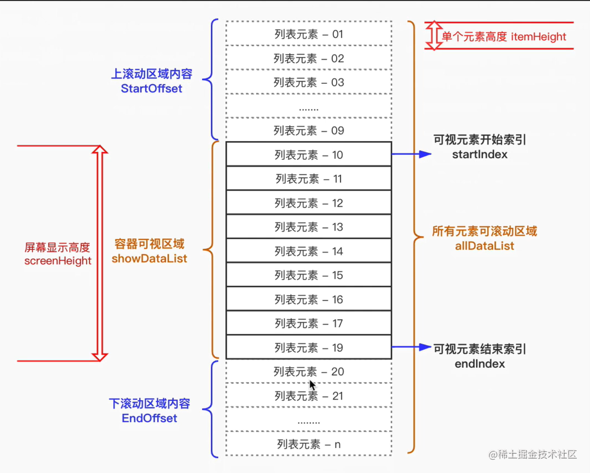

## 虚拟列表的使用场景

如果我想要在网页中放大量的列表项，纯渲染的话，对于浏览器性能将会是个极大的挑战，会造成滚动卡顿，整体体验非常不好，主要有以下问题：

- 页面等待时间极长，用户体验差
- CPU计算能力不够，滑动会卡顿
- GPU渲染能力不够，页面会跳屏
- RAM内存容量不够，浏览器崩溃

###### 1. 传统做法

对于长列表渲染，传统的方法是使用懒加载的方式，下拉到底部获取新的内容加载进来，其实就相当于是在垂直方向上的分页叠加功能，**`但随着加载数据越来越多，浏览器的回流和重绘的开销将会越来越大`**，整个滑动也会造成卡顿，这个时候我们就可以考虑使用虚拟列表来解决问题

###### 2. 虚拟列表

其核心思想就是在处理用户滚动时，只改变列表在可视区域的渲染部分，具体步骤为：

先计算可见区域起始数据的索引值`startIndex`和当前可见区域结束数据的索引值`endIndex`，假如元素的高度是固定的，那么`startIndex`的算法很简单，即`startIndex = Math.floor(scrollTop/itemHeight)`，`endIndex = startIndex + (clientHeight/itemHeight) - 1`，再根据`startIndex` 和`endIndex`取相应范围的数据，渲染到可视区域，然后再计算`startOffset`（上滚动空白区域）和`endOffset`（下滚动空白区域），这两个偏移量的作用就是来撑开容器元素的内容，从而起到缓冲的作用，使得滚动条保持平滑滚动，并使滚动条处于一个正确的位置

上述的操作可以总结成五步：

- 不把长列表数据一次性全部直接渲染在页面上
- 截取长列表一部分数据用来填充可视区域
- 长列表数据不可视部分使用空白占位填充（下图中的`startOffset`和`endOffset`区域）
- 监听滚动事件根据滚动位置动态改变可视列表
- 监听滚动事件根据滚动位置动态改变空白填充



## 定高虚拟列表实现步骤

> 实现的效果应该是：`不论怎么滚动，我们改变的只是滚动条的高度和可视区的元素内容，并没有增加任何多余的元素，下面来看看要怎么实现吧！`

```tsx
// 虚拟列表DOM结构
<div className='container'>
  // 监听滚动事件的盒子，该高度继承了父元素的高度
  <div className='scroll-box' ref={containerRef} onScroll={boxScroll}>
    // 该盒子的高度一定会超过父元素，要不实现不了滚动的效果，而且还要动态的改变它的padding值用于控制滚动条的状态
    <div style={topBlankFill.current}>
      {
      showList.map(item => <div className='item' key={item.commentId || (Math.random() + item.comments)}>{item.content}</div>)
      }
    </div>
  </div>
</div>
```

### 计算容器最大容积数量

简单来说，就是我们必须要知道在可视区域内最多能够容纳多少个列表项，这是我们在截取内容数据渲染到页面之前关键的步骤之一

```js
 // 滚动容器高度改变后执行的函数
const changeHeight = useCallback(throttle(() => {
  // 容器高度，通过操作dom元素获取高度是因为它不一定是个定值
  curContainerHeight.current = containerRef.current.offsetHeight
  // 列表最大数量，考虑到列表中顶部和底部可能都会出现没有展现完的item
  curViewNum.current = Math.ceil(curContainerHeight.current / itemHeight) + 1
}, 500), [])

useEffect(() => {
  // 组件第一次挂载需要初始化容器的高度以及最大容纳值
  changeHeight()
  // 因为我们的可视窗口和浏览器大小有关系，所以我们需要监听浏览器大小的变化
  // 当浏览器大小改变之后需要重新执行changeHeight函数计算当前可视窗口对应的最大容纳量是多少
  window.addEventListener('resize', changeHeight)
  return () => {
    window.removeEventListener('resize', changeHeight)
  }
}, [changeHeight])
```

### 监听滚动事件动态截取数据&&设置上下滚动缓冲消除快速滚动白屏

这是虚拟列表的核心之处，不将所有我们请求到的元素渲染出来，而是只渲染我们能够看到的元素，大大减少了容器内的dom节点数量。

不过有个隐藏的问题我们需要考虑到，当用户滑动过快的时候，很多用户的设备性能并不是很好，很容易出现屏幕已经滚动过去了，但是列表项还没有及时加载出来的情况，这个时候用户就会看到短暂的白屏，对用户的体验非常不好。所以我们需要设置一段缓冲区域，让用户过快的滚动之后还能看到我们提前渲染好的数据，等到缓冲数据滚动完了，我们新的数据也渲染到页面中去了！

```js
const scrollHandle = () => {
  // 注意这个对应的是可视区第一个元素的索引值，而不是第多少个元素
  let startIndex = Math.floor(containerRef.current.scrollTop / itemHeight) // itemHeight是列表每一项的高度
  // 优化：如果是用户滚动触发的，而且两次startIndex的值都一样，那么就没有必要执行下面的逻辑
  if (!isNeedLoad && lastStartIndex.current === startIndex) return
  isNeedLoad.current = false
  lastStartIndex.current = startIndex
  const containerMaxSize = curViewNum.current
  /**
   * 解决滑动过快出现的白屏问题：注意endIndex要在startIndex人为改变之前就计算好
   * 因为我们实际上需要三板的数据用于兼容低性能的设备，用做上下滚动的缓冲区域，避免滑动的时候出现白屏
   * 现在的startIndex是可视区的第一个元素索引，再加上2倍可视区元素量，刚好在下方就会多出一板来当做缓冲区
   */
  // 此处的endIndex是为了在可视区域的下方多出一板数据
  let endIndex = startIndex + 2 * containerMaxSize - 1
  // 接近滚动到屏幕底部的时候，就可以请求发送数据了，这个时候触底的并不是可视区的最后一个元素，而是多出那一版的最后一个元素触底了
  const currLen = dataListRef.current.length
  if (endIndex > currLen - 1) {
    // 更新请求参数，发送请求获取新的数据(但是要保证当前不在请求过程中，否则就会重复请求相同的数据)
    !isRequestRef.current && setOptions(state => ({ offset: state.offset + 1 }))
    // 如果已经滚动到了底部，那么就设置endIndex为最后一个元素索引即可
    endIndex = currLen - 1
  }
  // 此处的endIndex是为了在可视区域的上方多出一板数据
  // 这里人为的调整startIndex的值，目的就是为了能够在可视区域上方多出一板来当做缓冲区
  if (startIndex <= containerMaxSize) { // containerMaxSize是我们之前计算出来的容器容纳量
    startIndex = 0
  } else {
    startIndex = startIndex - containerMaxSize
  }
  // 使用slice方法截取数据，但是要记住第二个参数对应的索引元素不会被删除，最多只能删除到它的前一个，所以我们这里的endIndex需要加一
  setShowList(dataListRef.current.slice(startIndex, endIndex + 1))
}
```

### 动态设置上下空白占位

这是虚拟列表的灵魂所在，本质上我们数据量是很少的，一般来说只有几条到十几条数据，如果不对列表做一些附加的操作，连生成滚动条都有点困难，更别说让用户自由操控滚动条滚动了。

我们必须要用某种方法将内容区域撑起来，这样才会出现比较合适的滚动条。我这里采取的方法就是设置`paddingTop`和`paddingBottom`的值来动态的撑开内容区域。

为什么要动态的改变呢？举个例子，我们向下滑动的时候会更换页面中要展示的数据列表，如果不改变原先的空白填充区域，那么随着滚动条的滚动，原先展示在可视区的第一条数据就会向上移动，虽然我们更新的数据是正确的，但并没有将它们展示在合适的位置。完美的方案是是不仅要展示正确的数据，而且还要改变空白填充区域高度，使得数据能够正确的展示在浏览器视口当中。

```js
// 以下代码要放在更新列表数据之前，也是在滚动事件boxScroll当中
// 改变空白填充区域的样式，否则就会出现可视区域的元素与滚动条不匹配的情况，实现不了平滑滚动的效果
topBlankFill.current = {
  // 起始索引就是缓冲区第一个元素的索引，索引为多少就代表前面有多少个元素
  paddingTop: `${startIndex * itemHeight}px`,
  // endIndex是缓冲区的最后一个元素，可能不在可视区内；用dataListRef数组最后一个元素的索引与endIndex相减就可以得到还没有渲染元素的数目
  paddingBottom: `${(dataListRef.current.length - 1 - endIndex) * itemHeight}px`
}
```

### 下拉置地自动请求和加载数据

在真实的开发场景中，我们不会一次性请求1w、10w条数据过来，这样请求时间那么长，用户早就把页面关掉了，还优化个屁啊哈哈！

所以真实开发中，我们还是要结合原来的懒加载方式，等到下拉触底的时候去加载新的数据进来，放置到缓存数据当中，然后我们再根据滚动事件决定具体渲染哪一部分的数据到页面上去。

```js
// 组件刚挂载以及下拉触底的时候请求更多数据
useEffect(() => {
  (async () => {
    try {
      // 表明当前正处于请求过程中
      isRequestRef.current = true
      const { offset } = options
      let limit = 20
      if (offset === 1) limit = 40
      const { data: { comments, more } } = await axios({
        url: `http://localhost:3000/comment/music?id=${186015 - offset}&limit=${limit}&offset=1`
      })
      isNeedLoad.current = more
      // 将新请求到的数据添加到存储列表数据的变量当中
      dataListRef.current = [...dataListRef.current, ...comments]
      // 必选要在boxScroll之前将isRequestRef设为false，因为boxScroll函数内部会用到这个变量
      isRequestRef.current = false
      // 请求完最新数据的时候需要重新触发一下boxScroll函数，因为容器内的数据、空白填充区域可能需要变化
      boxScroll()
    } catch (err) {
      isRequestRef.current = false
      console.log(err);
    }
  })()
  // 在boxScroll函数里面，一旦发生了触底操作就会去改变optiosn的值
}, [options])
```

### 滚动事件请求动画帧进行节流优化

虚拟列表很依赖于滚动事件，考虑到用户可能会滑动很快，我们在用节流优化的时候事件必须要设置的够短，否则还是会出现白屏现象。

这里我没有用传统的节流函数，而是用到了请求动画帧帮助我们进行节流，这里我就不做具体介绍了，想了解的可以看我另一篇文章**juejin.cn/post/708236…**[1]**juejin.cn/post/684490…**[2]

```js
// 利用请求动画帧做了一个节流优化
let then = useRef(0)
const boxScroll = () => {
  const now = Date.now()
  /**
   * 这里的等待时间不宜设置过长，不然会出现滑动到空白占位区域的情况
   * 因为间隔时间过长的话，太久没有触发滚动更新事件，下滑就会到padding-bottom的空白区域
   * 电脑屏幕的刷新频率一般是60HZ，渲染的间隔时间为16.6ms，我们的时间间隔最好小于两次渲染间隔16.6*2=33.2ms，一般情况下30ms左右，
   */
  if (now - then.current > 30) {
    then.current = now
    // 重复调用scrollHandle函数，让浏览器在下一次重绘之前执行函数，可以确保不会出现丢帧现象
    window.requestAnimationFrame(scrollHandle)
  }
}
```

当然，填充空白区域、模拟滚动条还有其它的办法，比如根据总数据量让一个盒子撑开父盒子用于生成滚动条，根据`startIndex`计算出可视区域距离顶部的距离并调节内容区域元素的`transform`属性，即`startOffset = scrollTop - (scrollTop % this.itemSize)`，让内容区域一直暴露在可视区域内

目前为止，我们已经实现了固定高度的列表项用虚拟列表来展示的功能！接下里我们将会介绍关于不定高（其高度由内容进行撑开）的列表项如何用虚拟列表进行优化

## 不定高虚拟列表实现步骤

> 微博是一个很典型的不定高虚拟列表

在之前的实现中，列表项的高度是固定的，因为高度固定，所以可以很轻易的就能获取列表项的整体高度以及滚动时的显示数据与对应的偏移量。而实际应用的时候，当列表中包含文本、图片之类的可变内容，会导致列表项的高度并不相同。

我们在列表渲染之前，确实没有办法知道每一项的高度，但是又必须要渲染出来，那怎么办呢？

这里有一个解决方法，就是`先给没有渲染出来的列表项设置一个预估高度，等到这些数据渲染成真实dom元素了之后，再获取到他们的真实高度去更新原来设置的预估高度`，下面我们来看看跟定高列表有什么不同，具体要怎么实现吧！

### 请求到新数据对数据进行初始化（设置预估高度）

预估高度的设置其实是有技巧的，列表项预估高度设置的越大，展现出来的数据就会越少，所以当预估高度比实际高度大很多的时候，很容易出现可视区域数据量太少而引起的可视区域出现部分空白。为了避免这种情况，我们的预估高度应该设置为列表项产生的最小值，这样尽管可能会多渲染出几条数据，但能保证首次呈现给用户的画面中没有空白

```js
// 请求更多的数据
useEffect(() => {
  (async () => {
    // 只有当前不在请求状态的时候才可以发送新的请求
    if (!isRequestRef.current) {
      console.log('发送请求了');
      try {
        isRequestRef.current = true
        const { offset } = options
        let limit = 20
        if (offset === 1) limit = 40
        const { data: { comments, more } } = await axios({
          url: `http://localhost:3000/comment/music?id=${186015 - offset}&limit=${limit}&offset=1`
        })
        isNeedLoad.current = more
        // 获取缓存中最后一个数据的索引值，如果没有，则返回-1
        const lastIndex = dataListRef.current.length ? dataListRef.current[dataListRef.current.length - 1].index : -1
        // 先将请求到的数据添加到缓存数组中去
        dataListRef.current = [...dataListRef.current, ...comments]
        const dataList = dataListRef.current
        // 将刚刚请求到的新数据做一下处理，为他们添加上对应的索引值、预估高度、以及元素首尾距离容器顶部的距离
        for (let i = lastIndex + 1, len = dataListRef.current.length; i < len; i++) {
          dataList[i].index = i
          // 预估高度是列表项对应的最小高度
          dataList[i].height = 63
          // 每一个列表项头部距离容器顶部的距离等于上一个元素尾部距离容器顶部的距离
          dataList[i].top = dataList[i - 1]?.bottom || 0
          // 每一个列表项尾部距离容器顶部的距离等于上一个元素头部距离容器顶部的距离加上自身列表项的高度
          dataList[i].bottom = dataList[i].top + dataList[i].height
        }
        isRequestRef.current = false
        boxScroll()
      } catch (err) {
        console.log(err);
      } finally {
        isRequestRef.current = false
      }
    }
  })()
  // eslint-disable-next-line
}, [options])
```

### 每次列表更新之后将列表项真实高度更新缓存中的预估高度

在`React`函数式组件中，`useEffect`只要不传第二个参数，就可以实现类组件`componentDidUpdate`生命周期函数的作用，只要我们重新渲染一次列表组件，就会重新计算一下当前列表每一项中的真实高度并更新到缓存中去，当下次我们再用到缓存中的这些数据时，使用的就是真实高度了

```js
// 每次组件重新渲染即用户滚动更改了数据之后需要将列表中我们还不知道的列表项高度更新到我们的缓存数据中去，以便下一次更新的时候能够正常渲染
useEffect(() => { 
  const doms = containerRef.current.children[0].children
  const len = doms.length
  // 因为一开始我们没有请求数据，所以即使组件渲染完了，但是没有列表项，此时不需要执行后续操作
  if (len) {
    // 遍历所有的列表结点，根据结点的真实高度去更改缓存中的高度
    for (let i = 0; i < len; i++) {
      const realHeight = doms[i].offsetHeight
      const originHeight = showList[i].height
      const dValue = realHeight - originHeight
      // 如果列表项的真实高度就是缓存中的高度，则不需要进行更新
      if (dValue) {
        const index = showList[i].index
        const allData = dataListRef.current
        /**
           * 如果列表项的真实高度不是缓存中的高度，那么不仅要更新缓存中这一项的bottom和height属性
           * 在该列表项后续的所有列表项的top、bottom都会受到它的影响，所以我们又需要一层for循环进行更改缓存中后续的值
           */
        allData[index].bottom += dValue
        allData[index].height = realHeight
        /**
           * 注意：这里更改的一定要是缓存数组中对应位置后续的所有值，如果只改变的是showList值的话
           * 会造成dataList间断性的bottom和下一个top不连续，因为startIndex、endIndex以及空白填充区域都是依据top和bottom值来进行计算的
           * 所以会导致最后计算的结果出错，滑动得来的startIndex变化幅度大且滚动条不稳定，出现明显抖动问题
           */
        for (let j = index + 1, len = allData.length; j < len; j++) {
          allData[j].top = allData[j - 1].bottom
          allData[j].bottom += dValue
        }
      }
    }
  }
  // eslint-disable-next-line
})
```

### 得到可视区域的起始和结束元素索引&&设置上下滚动缓冲区域消除快速滚动白屏

列表项的`bottom`属性代表的就是该元素尾部到容器顶部的距离，不难发现，可视区的第一个元素的`bottom`是第一个大于滚动高度的；可视区最后一个元素的`bottom`是第一个大于（滚动高度+可视高度）的。我们可以利用这条规则遍历缓存数组找到对应的`startIndex`和`endIndex`

由于我们的缓存数据，本身就是有顺序的，所以获取开始索引的方法可以考虑通过二分查找的方式来降低检索次数，减少时间复杂度

```js
// 得到要渲染数据的起始索引和结束索引
const getIndex = () => {
  // 设置缓冲区域的数据量
  const aboveCount = 5
  const belowCount = 5
  // 结果数组，里面包含了起始索引和结束索引
  const resObj = {
    startIndex: 0,
    endIndex: 0,
  }
  const scrollTop = containerRef.current.scrollTop
  const dataList = dataListRef.current
  const len = dataList.length
  // 设置上层缓冲区，如果索引值大于缓冲区域，那么就需要减小startIndex的值用于设置顶层缓冲区
  const startIndex = binarySearch(scrollTop)
  if (startIndex <= aboveCount) {
    resObj.startIndex = 0
  } else {
    resObj.startIndex = startIndex - aboveCount
  }
  /**
     * 缓冲数据中第一个bottom大于滚动高度加上可视区域高度的元素就是可视区域最后一个元素
     * 如果没有找到的话就说明当前滚动的幅度过大，缓存中没有数据的bottom大于我们的目标值，所以搜索不到对应的索引，我们只能拿缓存数据中的最后一个元素补充上
     */
  const endIndex = binarySearch(scrollTop + curContainerHeight.current) || len - 1
  // 增大endIndex的索引值用于为滚动区域下方设置一段缓冲区，避免快速滚动所导致的白屏问题
  resObj.endIndex = endIndex + belowCount
  return resObj
}

// 由于我们的缓存数据，本身就是有顺序的，所以获取开始索引的方法可以考虑通过二分查找的方式来降低检索次数：
const binarySearch = (value) => {
  const list = dataListRef.current
  let start = 0;
  let end = list.length - 1;
  let tempIndex = null;
  while (start <= end) {
    let midIndex = parseInt((start + end) / 2);
    let midValue = list[midIndex].bottom;
    if (midValue === value) {
      // 说明当前滚动区域加上可视区域刚好是一个结点的边界，那么我们可以以其下一个结点作为末尾元素
      return midIndex + 1;
    } else if (midValue < value) {
      // 由于当前值与目标值还有一定的差距，所以我们需要增加start值以让下次中点的落点更靠后
      start = midIndex + 1;
    } else if (midValue > value) {
      // 因为我们的目的并不是找到第一个满足条件的值，而是要找到满足条件的最小索引值
      if (tempIndex === null || tempIndex > midIndex) {
        tempIndex = midIndex;
      }
      // 由于我们要继续找更小的索引，所以需要让end-1以缩小范围，让下次中点的落点更靠前
      end--
    }
  }
  return tempIndex;
}
```

### 监听滚动事件动态截取数据&&动态设置上下空白占位

动态截取数据的操作和定高的虚拟列表几乎一样，区别比较大的地方就在`padding`值的计算方式上。在定高的列表中，我们可以根据起始索引值和结尾索引值直接计算出空白填充区域的高度。

其实在不定高的列表中，计算方式更加简单，因为`startIndex`对应元素的`top`值就是我们需要填充的上空白区域，下空白区域也可以根据整个列表的高度（最后一个元素的bottom值）和`endIndex`对应元素的`bottom`值之差得出

```js
const scrollHandle = () => {
  // 获取当前要渲染元素的起始索引和结束索引值
  let { startIndex, endIndex } = getIndex()
  /**
     * 如果是用户滚动触发的，而且两次startIndex的值都一样，那么就没有必要执行下面的逻辑，
     * 除非是用户重新请求了之后需要默认执行一次该函数，这是一种特殊情况，就是startIndex没变，但需要执行后续的操作
     */
  if (!isNeedLoad && lastStartIndex.current === startIndex) return
  // 渲染完一次之后就需要初始化isNeedLoad
  isNeedLoad.current = false
  // 用于实时监控lastStartIndex的值
  lastStartIndex.current = startIndex
  // 下层缓冲区域最后的元素接触到屏幕底部的时候，就可以请求发送数据了
  const currLen = dataListRef.current.length
  if (endIndex >= currLen - 1) {
    // 当前不在请求状态下时才可以改变请求参数发送获取更多数据的请求
    !isRequestRef.current && setOptions(state => ({ offset: state.offset + 1 }))
    // 注意endIndex不可以大于缓存中最后一个元素的索引值
    endIndex = currLen - 1
  }
  // 空白填充区域的样式
  topBlankFill.current = {
    // 改变空白填充区域的样式，起始元素的top值就代表起始元素距顶部的距离，可以用来充当paddingTop值
    paddingTop: `${dataListRef.current[startIndex].top}px`,
    // 缓存中最后一个元素的bottom值与endIndex对应元素的bottom值的差值可以用来充当paddingBottom的值
    paddingBottom: `${dataListRef.current[dataListRef.current.length - 1].bottom - dataListRef.current[endIndex].bottom}px`
  }
  setShowList(dataListRef.current.slice(startIndex, endIndex + 1))
}
```

### 问题思考

我们虽然实现了根据列表项动态高度下的虚拟列表，但如果列表项中包含图片，并且列表高度由图片撑开。在这种场景下，由于图片会发送网络请求，列表项可能已经渲染到页面中了，但是图片还没有加载出来，此时无法保证我们在获取列表项真实高度时图片是否已经加载完成，获取到的高度有无包含图片高度，从而造成计算不准确的情况。

但是这种任意由图片来撑开盒子大小的场景很少见，因为这样会显得整个列表很不规则。大多数展示图片的列表场景，其实都是提前确定要展示图片的尺寸的，比如微博，1张图片的尺寸是多少，2x2，3x3的尺寸是多少都是提前设计好的，只要我们给img标签加了固定高度，这样就算图片还没有加载出来，但是我们也能够准确的知道列表项的高度是多少。

如果你真的遇到了这种列表项会由图片任意撑开的场景，可以给图片绑定`onload`事件，等到它加载完之后再重新计算一下列表的高度，然后把它更新到缓存数据中，这是一种方法。其次，还可以使用**ResizeObserver**[3]来监听列表项内容区域的高度改变，从而实时获取每一列表项的高度，只不过MDN有说道这只是在实验中的一个功能，所以暂时可能没有办法兼容所有的浏览器！