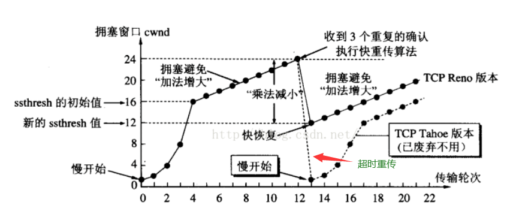

# TCP慢启动

## 慢启动

TCP建立连接后，每次发送的报文数不固定，从1开始，逐次倍增，1,2,4,8这样增加，这个过程叫**慢启动**，当前每次发送的报文数被称为**拥塞窗口cwnd**

## 门限ssthreshold

慢启动达到门限后，cwnd会变成每次增加1

## 超时重传

发送的报文会进入缓冲区，如果客户端超时没有确认，就会重发该报文，如果确认就从缓冲区删除，当数量越来越多，肯定会超出带宽限制，导致超时，此时就会让慢启动门限改为当前每次发送的一半，即ssthreshold=cwnd/2

然后重新开始慢启动，重启的cwnd初始化有两种情况

- 如果超时时间内所有报文都超时，cwnd=1
- 如果只是部分报文超时，则cwnd=原来的cwnd/4，被称为**快恢复**

> 超时时间是根据每次报文的往返时间动态计算的

## 常见问题

**Q：单次发送的报文数固定吗**

A:
不是。
建立连接后，会先只发1条， 然后发2条，接着再发4条，逐步增加。
这个过程叫 **“慢启动”**。
这个1、2、4递增的数量被称之为 **拥塞窗口** cwnd

可以理解为TCP希望刚开始，可以大胆点，不断加数量。但为了保险期间还是从1条还是倍增。

------

**Q: 慢启动过程中，那么发送数量（拥塞窗口）什么时候不再倍增？是无限倍增吗？**

A:
不会无限倍增。
当到达**慢启动门限ssthreshold**时，会变成每次都增加1条。
这个过程叫**拥塞避免过程**， 也有叫他拥塞避免算法的

可以理解为tcp感觉到有风险了，于是开始慢慢地、小心翼翼地1条1条地添加发送条数。

------

**Q:那么，当进入拥塞避免，每次+1时，什么时候才会不再继续加？**

A:
随着每次发送的数量越发越多， 最终会超出带宽限制，于是就会有某条报文发生超时。
有可能是发的中途丢了， 亦或者是返回的数据全阻塞住了，一条都回不来。

当发送端检测到发生超时时，就会让 **慢启动门限ssthreshold = 当前拥塞窗口cwnd/2**
接着**cwnd 重新置为1**，从新开始 慢启动算法。

这样的好处在于可以检测到每次发送的上限，动态调整发送窗口。
上面的过程叫做 **超时重传**。
注意发生超时重传时， cwnd会重置成1。

------

**Q: 上面提到了超时， 那么TCP客户端是怎么判断报文发送超时的呢？**

A:
每次发送数据包的时候， 都会有一个相应的计时器，一旦超过 RTO(超时时间） 而没有收到 ACK， TCP就会重发该数据包。
没收到 ACK 的数据包都会存在重传缓冲区里，等到 ACK 后，就从缓冲区里删除。

------

**Q:上面提到的超时时间RTO是怎么来的？万一设得太大可能导致很迟才能反应过来， 设得太小则可能导致每条都超时**

A:
通过“每次报文的往返时间样本”和“之前样本的偏差值”**动态计算**出来的。

- RTT ： 报文往返时间（指从发送到收到ack的时间）。每个报文发出后都有个定时器，收到后都会计算出一个RTT样本

------

- RTTs： 加权平均往返时间，类似于一个估算的往返时间，实时在变。
  RTTs = （1-a) * RTTs + a * RTT最新样本
  即每次得到RTT样本后，  都会使用a这个占比去更新RTTs。

------

- RTTd:  RTT偏差加权平均值（就是用来计算超时时间应该比RTT多多少）
  RTTd = (1 - b) * RTTd + b*RTTs - RTT最新样本
  即每次会用新的RTTs以b的占比去更新一下RTTd，并减去RTT样本

------

- RTO ： 超时重传时间
  等于平均往返时间 加上 4倍偏差值
  RTO = RTTs + 4*RTTd

------

**Q: 如果发生重传，却还是没有收到ack，那么最新的RTT样本应该怎么算？即你都收不到最新的ack了， RTT难道取超时时间吗？**

A:
会使用karn算法： 发生重传时，不更新这次的RTT样。选用后面收到的ack
修正karn： 为了避免发生重传后，实际RTT都变慢了，导致一下子所有请求都超时， 会在发生重传时，把RTO假大1倍。

------

**Q: 上面提到的ACK超时判断会不会太久了？ 假如只是发的时候丢了中间部分报文而已， 但大部分报文ACK还能正常返回，也要一直等超时吗？**

A:
如果能正常接收其他报文的ACK， 只是中间的部分报文丢了， 则有另一个办法。

接收端有一个冗余确认机制：

1. 发送端A 发送 1、2、3、4、5四条
2. 但是B接收端只收到1、2、4、5，而3因为网络拥塞丢了。
3. 于是B会发送ack=3而不是ack=5 给A。 **这就是冗余确认机制，只发送缺失那部分的ack，后面的4和5都不管。**
4. A收到ack=3后， 继续发送3、4、5、6、7， 结果3还是丢了。
5. 于是B又发送ack=3。

当A发现连续3次收到了ack=3时，就会觉察到不对劲，我都发3次了你还是说没收到，可你又能正常返回其他ACK给我，是不是我发的太多了？

上面这个判断3次的重传算法叫“快重传”。

于是A会马上进入 “快速恢复”。
和之前类似，慢启动门限ssthreshold = 当前拥塞窗口cwnd/2
但是！！ 新的拥塞窗口cwnd会设置成ssthreshold/2， 而不是1。
而且不会走慢启动倍增的那种，而是走拥塞避免， 逐步+1的那种。

------

**Q: 前面“超时重传”的时候，是变成从1开始慢启动， 为什么这个“快重传”却是从ssthreshold/2开始，并且走拥塞避免？ 为什么会有这个区别？**

A:
因为前面发生超时重传时， 是比较严重的情况， 超时时间内一个ACK都没收到。就好像来回数据都凭空消失了。

而快速重传发生时， 还是能收到部分ack的， 只是丢失了部分数据， 说明拥塞没那么严重，于是可以大胆一点将cwnd削减到1/4， 而不是直接从1开始。

**Q: 为啥发送地多了，数据就会部分丢失？这个是怎么个原理？**

A:
路由器有缓存，IP分组接收过多时就会耗尽空间，丢弃数据。详细可以看路由器的数据转发原理。

------

**Q: TCP除了上面的重传定时器， 好象还有个坚持定时器？区别是啥？**

A:
坚持定时器和超时、网络拥塞没有关系， 和通告窗口即对端的接收能力有关。
简单来说， 就是对方的传输层缓冲区（接收端窗口）满了，告诉你别发了，我吃不下了，于是返回通告窗口为0。
但你想知道啥时候可以发，于是就启动一个坚持定时器，每隔5s发送1个字节的小报文，小小地试探下。当通告窗口不为0了，就重新开始发。
